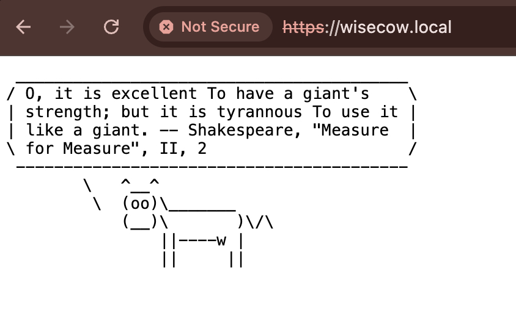
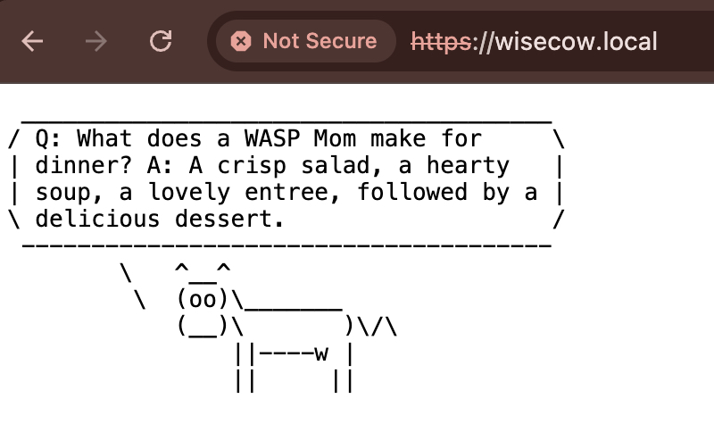

# Wisecow Project

## 📌 Project Overview
The **Wisecow project** is a small demo application containerized with Docker and deployed on **Kubernetes (Minikube)**.  
It simulates a fun "talking cow" application, accessible through a browser on port `4499`.

---

## 🔧 What was done
1. **Containerization**  
   - Created a `Dockerfile` for the wisecow application.
   - Built and pushed the Docker image to DockerHub.

2. **Kubernetes Deployment**  
   - Defined Kubernetes manifests: `Deployment`, `Service`, and `Ingress`.
   - Deployed the app to Minikube.
   - Verified access via browser (`http://wisecow.local`).

### 🖼️ Screenshots



3. **CI/CD Pipeline**  
   - Implemented GitHub Actions workflow (`.github/workflows/ci.yml`) for:
     - Building Docker images automatically.
     - Pushing images to DockerHub.
   - Implemented a CD pipeline (`cd.yml`) to:
     - Deploy manifests into Minikube.
     - Verify pod and service status.

---

## 📂 Files & Folders
- `Dockerfile` → Containerization
- `deploy.yaml` → Kubernetes Deployment
- `svc.yaml` → Kubernetes Service
- `ingress.yaml` → Ingress resource for local DNS access
- `.github/workflows/` → CI/CD pipelines

---

## 🚀 How to Run Locally
1. Start Minikube:
   ```bash
   minikube start
2. Deploy Kubernetes manifests:
   ```bash
   - kubectl apply -f deploy.yaml
   - kubectl apply -f svc.yaml
   - kubectl apply -f ingress.yaml
3. Access the app:
   - minikube service wisecow-service
